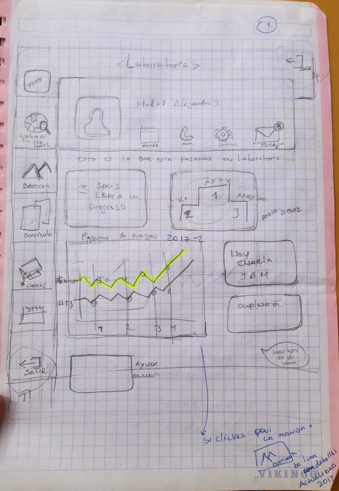
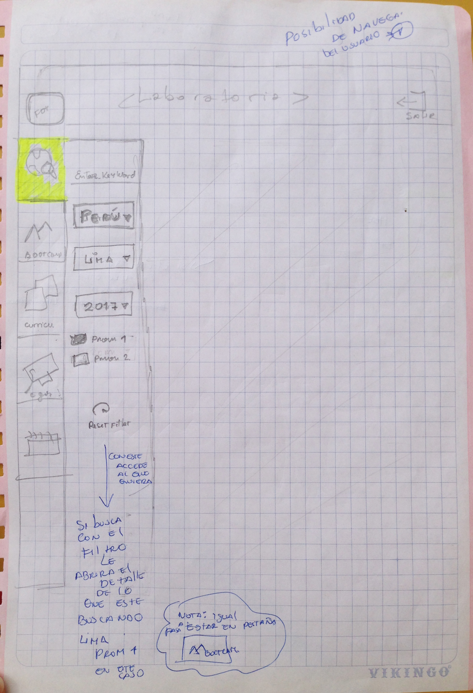
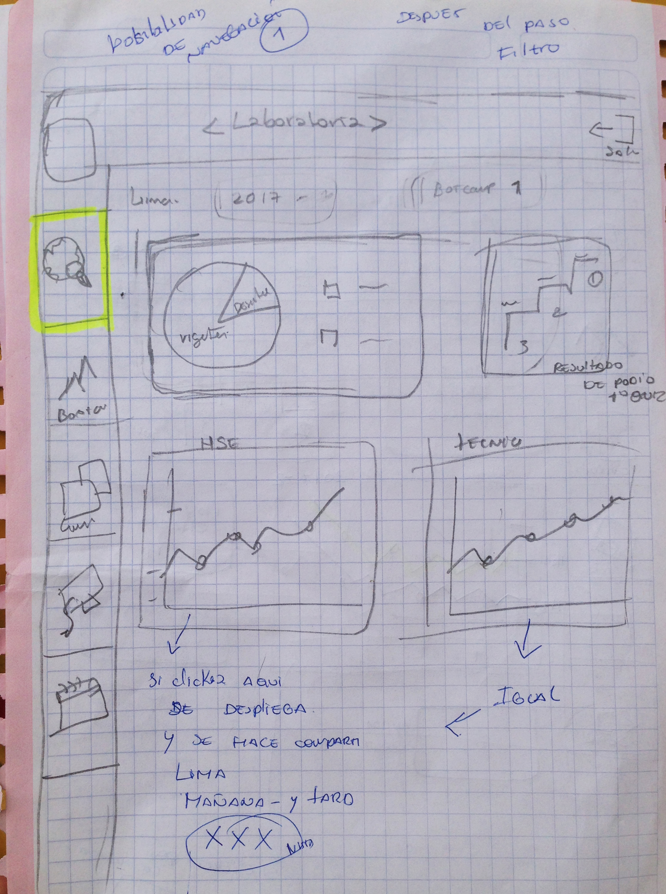
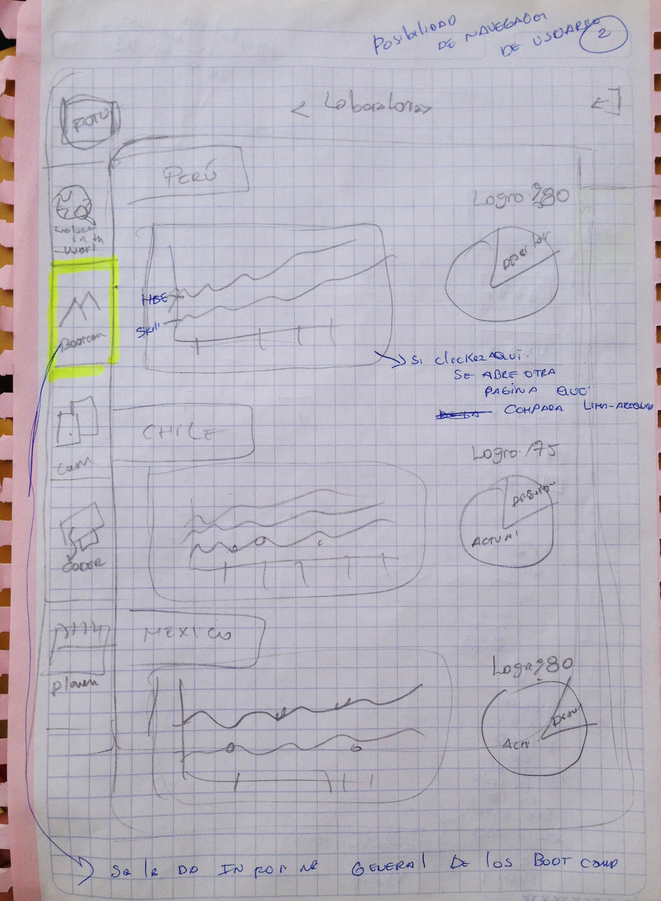
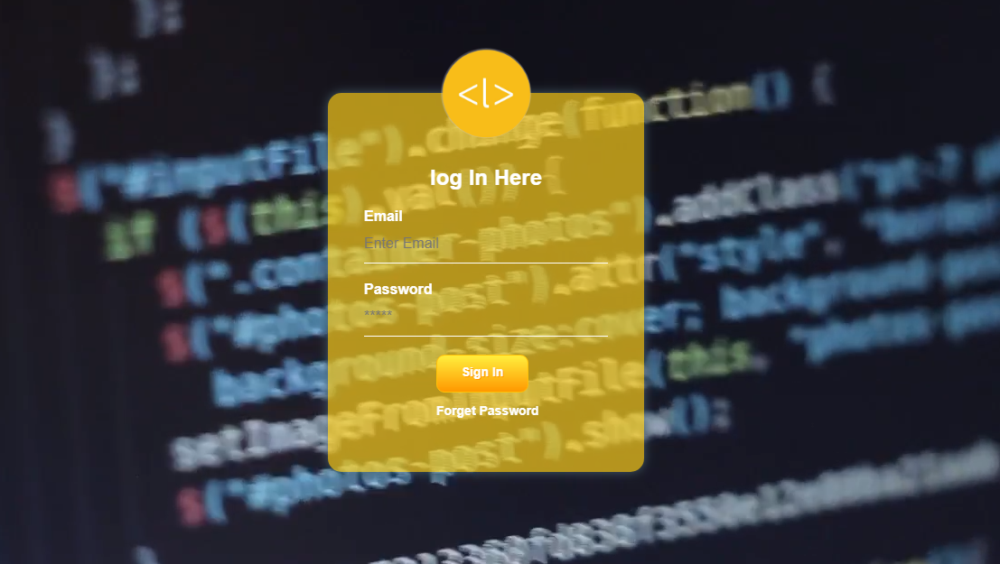
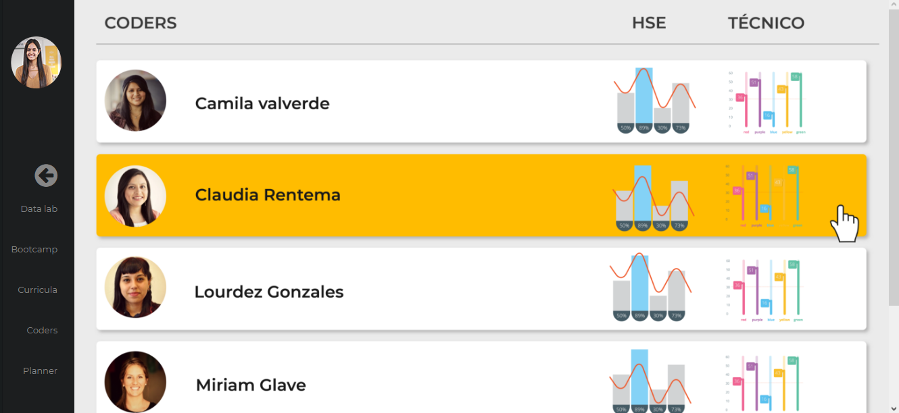

# Data Dashboard

* **Track:** _Common Core_
* **Curso:** _Creando tu primer sitio web interactivo_
* **Unidad:** _Producto final_

***

##### Instrucciones previas al trabajo

1. Debes realizar un [**fork**](https://gist.github.com/ivandevp/1de47ae69a5e139a6622d78c882e1f74)
   de este repositorio.

2. Luego deberás **clonar** tu fork en tu máquina. Recuerda que el comando a usar
   es `git clone` y su estructura normalmente se ve así:

   `git clone https://github.com/<nombre-de-usuario>/freelancer.git`
3. Cuando hayas terminado tu producto, envía un Pull Request a este repositorio
   (puedes solicitar apoyo de tus profes para este paso).

## Descripción de Nuestro proyecto

#### sketch:

Como primer paso nosotros realizamos la maquetación en sketch de como se iba realizar el proyecto, detallando
cada posible vista de las opciones de navegación que podría tener el futuro usuario.

### Primeras vistas maquetadas de proyecto

___
## Contenido

Este proyecto contiene:

1. Un archivo  **`README.md`** que explica el contenido del repositorio.

2. Tres carpetas `assets` `css` `js` donde se encuentra las imágenes, hojas de estilo css y data utilizadas en el trabajo.

## Autoras
Karina Julissa Buhezo Flores.

Kattia Rojas Arohuanca.

## Fecha
30/11/2017
